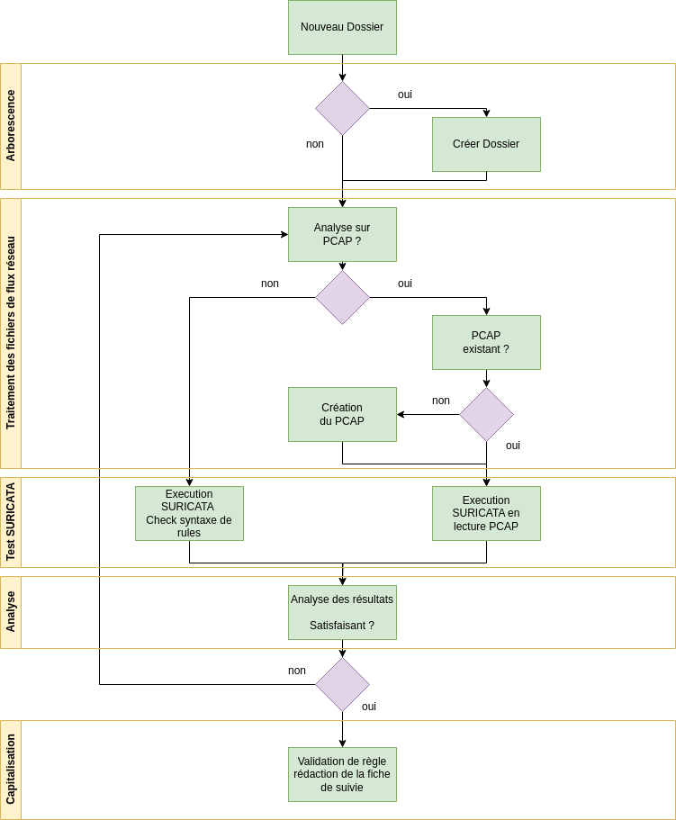

## SPQR

Le projet SPQR a pour objectifs :

* De mettre en place un LAB de test de règles de sondes réseau
* De faciliter et d'automatiser les tests de règles SURICATA

## Description
### Arborescence

```
spqr
|   README.md
|   main.ipynb
|
├── config
│   ├── config.json
│   ├── suricata-6.0.15.yaml
│   └── suricata.rules
├── input
├── notebooks
├── output
├── ressources
│   ├── Logigramme.drawio
│   ├── suricata-6.0.15.yaml
│   └── venv_python.sh
└── scripts
    ├── generate_path
    │   └── folder.py
    ├── generate_traffic
    │   └── spqrlib.py
    └── select_process
        └── process.py
```

- main.ipynb

Fichier principal pour la tâche de création de règle. 

- config

Dossier qui contient les fichiers de configuration indispensable pour chaque tâches de création de règles.

    - config.json
    Le fichier config.json contient les variables pour la génération de flux réseau. L'analyste pourra modifier ces variables en fonction de ces besoins pour les tests de règles.

    - suricata-*.yaml
    Fichier de configuration de SURICATA.

    - *.rules
    Fichiers contenant les règles de sonde SURICATA.

- input

Dossier où l'analyste pourra déposer des fichiers en vue des tests (exemple: les fichiers pcap issu de rejeu de malware)

- notebooks

Dossier contenant divers notebooks (actuellement vide)

- output

Dossier de sorti des résultats de process de test de règles

- ressources

Dossier contenant les fichiers utilent à la compréhension et la mise en oeuvre de SPQR.

    - Logigramme.drawio

    Fichier décrivant les différents processus pour SPQR.

    - suricata-6.0.15.yaml

    Fichier de configuration par défaut de SURICATA dans la version 6.0.15

    - venv_python.sh

    Fichier executable pour la création d'un environnement python virtuel.

- scripts

Dossier contenant les différents scripts pour le fonctionnement de SPQR.

    - generate_path

    Dossier contenant les différents scripts permettant la gestion de l'arboressence lors du process de création de règles de détection.

    - generate_traffic

    Dossier contenant la library spqrlib.py. Ce fichier contient les class et fonction python pouvant générer des flux réseau au format pcap en se basant sur les variables définies dans le fichier spqr/config/config.json

    - select_process

    Dossier contenant les scripts permettant d'établir le cheminement dans le déroulé du process.

## Process

Le fonctionnement de SPQR suit le process suivant :

 


